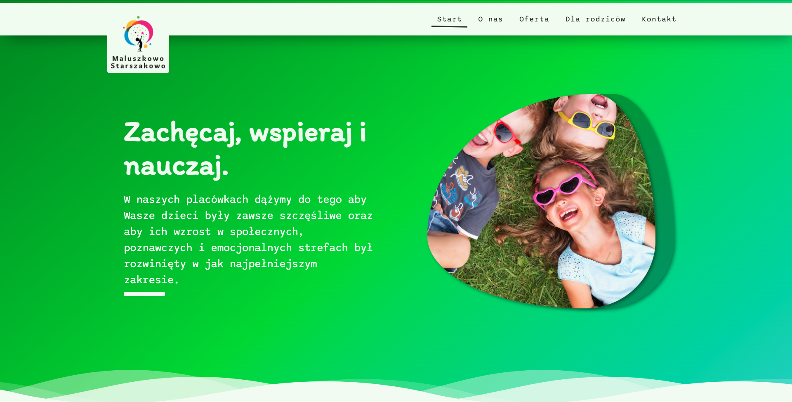

# Nursery website
A website created for the polish private nursery in the "hybrid" app model. Django is in charge of serving React app and also providing FE data through the REST framework. Data are saved in Heroku's PostgreSQL database.
Thanks to the Django, user is able to easily change almost every aspect of the website through the admin panel.

## Check Here ==> https://maluszkowo-438432782-ea148edbd2ec.herokuapp.com/

## Maluszkowo

## Technologies
* React, Django, Django REST

## Contact
Created by Jakub Folta [@folta.me](https://www.folta.me/) - feel free to contact me! 
